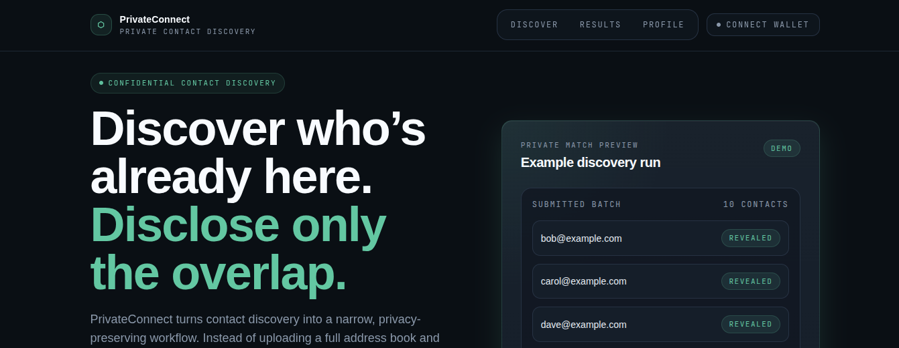
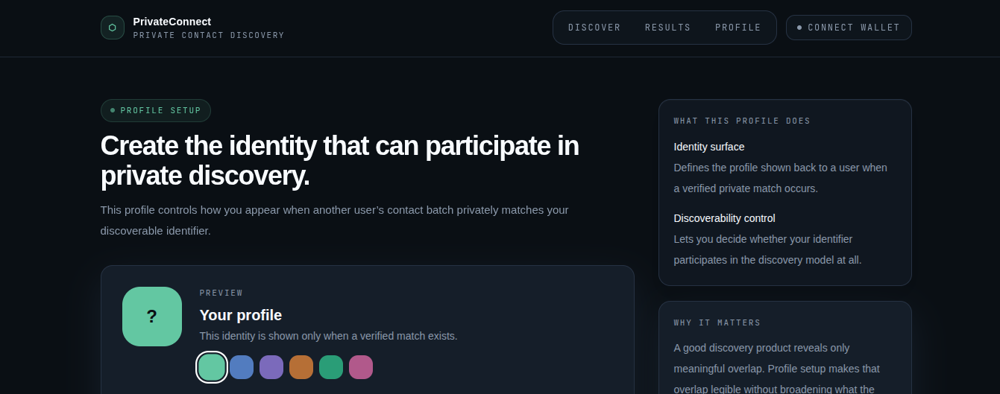
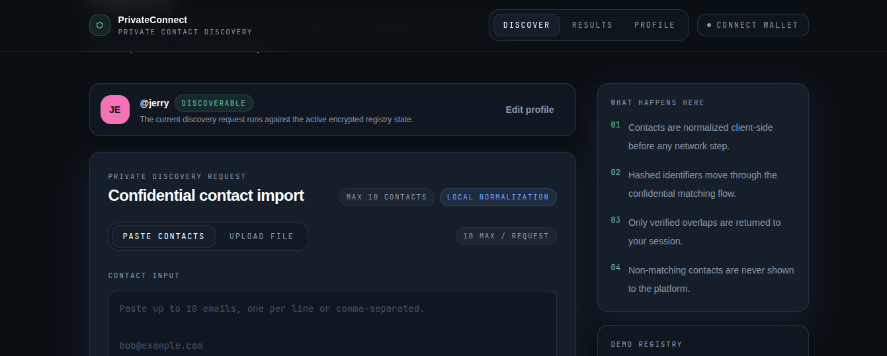
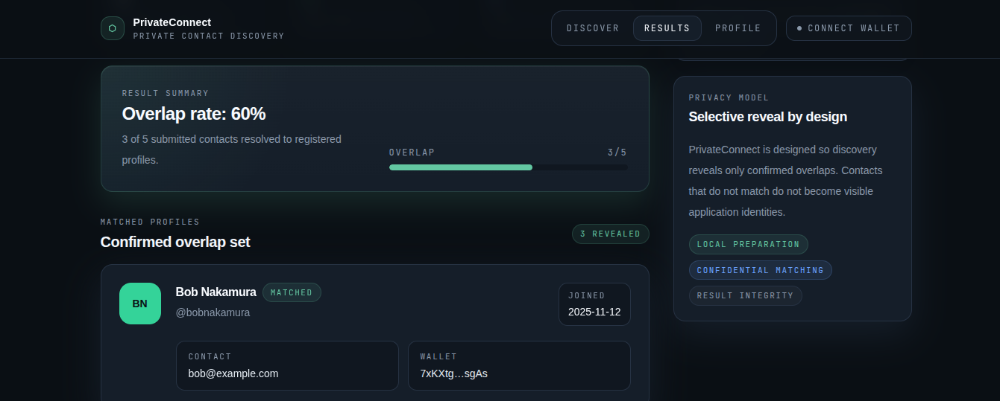
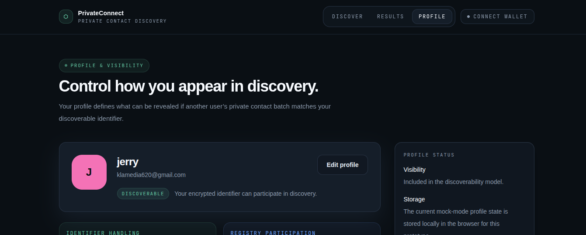

# PrivateConnect

> Discover which of your contacts are already on the platform — without disclosing your address book.


PrivateConnect is a privacy-preserving contact discovery product concept and frontend MVP. Instead of uploading a full address book to a central service, the user imports a small batch of contacts, the system prepares identifiers locally, and the product reveals only confirmed overlap.

The goal is simple:

**show the matches, hide everything else.**

---

## Why this matters

Traditional contact discovery usually requires sending an address book to a server so it can compare contacts against a central registry. That model leaks far too much information: it tells the platform who you know, who you searched for, and which non-users exist in your graph.

PrivateConnect is designed around a narrower and more defensible privacy model:

- only confirmed matches should be revealed
- non-matching contacts should remain hidden
- discoverability should remain user-controlled
- the privacy workflow should be understandable to the user

---

## What PrivateConnect does

PrivateConnect helps a user answer one question:

**Which of my contacts are already here?**

The product flow is intentionally constrained:

1. Create a profile and control discoverability
2. Import up to 10 contacts
3. Normalize contacts locally
4. Run a staged private discovery flow
5. Show only matched profiles
6. Keep non-matching contacts outside the visible result set

---

## Current scope

This repository currently represents a **polished frontend MVP / demo branch**.

It includes:

- a complete end-to-end frontend journey
- local profile creation and profile editing
- explicit discovery progress states
- a seeded demo registry
- matched-only results rendering
- local/session-based demo storage for the flow

### Current product surfaces

- `/` — landing page
- `/onboard` — profile creation
- `/discover` — contact import and discovery
- `/results` — matched results only
- `/profile` — profile and discoverability settings

---

## Discovery flow

The discovery experience is intentionally explicit. The progress states are part of the product story, not just loading UI.

### Current discovery phases

- `idle`
- `normalizing`
- `encrypting`
- `submitting`
- `processing`
- `complete`
- `failed`

These states make the privacy workflow legible to reviewers, judges, and users.

---

## Privacy guarantees

PrivateConnect is built around **selective reveal**.

### What the product should reveal
- confirmed matches
- match count
- protected non-match count

### What the product should not broadly expose
- the full submitted contact list
- non-matching contacts
- unnecessary identity data for unmatched entries
- a broad contact-upload reveal surface

The result view is intentionally narrow by design.

---

## How it works

In plain language:

- the user prepares a small contact batch
- identifiers are normalized locally
- the product runs a private discovery flow
- only confirmed overlap is surfaced back to the user
- non-matching entries remain outside the visible result model

### Architecture direction

The intended architecture has three layers:

```text
┌───────────────────────────────────────────────────────────────────┐
│                           Frontend (Next.js)                     │
│  - Wallet connection                                             │
│  - Contact import                                                │
│  - Local normalization                                           │
│  - Encryption / request submission                               │
│  - Progress UI                                                   │
│  - Result rendering                                              │
└───────────────────────────────┬───────────────────────────────────┘
                                │
                                ▼
┌───────────────────────────────────────────────────────────────────┐
│                     Solana Program (Anchor)                      │
│  - Owns public state                                             │
│  - Stores profiles / discoverability records                     │
│  - Queues confidential computation                               │
│  - Receives callback output                                      │
└───────────────────────────────┬───────────────────────────────────┘
                                │
                                ▼
┌───────────────────────────────────────────────────────────────────┐
│                  Arcium Confidential Compute                     │
│  - Compares encrypted identifiers                               │
│  - Computes overlap privately                                   │
│  - Returns compact result                                       │
└───────────────────────────────────────────────────────────────────┘
````

---

## How Arcium is used

The intended confidential-compute model is:

* the frontend prepares identifiers client-side
* guest query inputs are encrypted for confidential processing
* registry-side discoverability data is held in a confidentially matchable form
* Arcium executes the overlap computation over encrypted inputs
* the result is compact and scoped to the requesting user flow

For the MVP, the confidential output is intentionally small and bounded so the result model stays practical and reviewer-friendly.

---

## Demo in 2 Minutes

### 1. Install and run

```bash
cd app
npm install
npm run dev
```

Open:

```text
http://localhost:3000
```

### 2. Create a profile

Go to `/onboard` and create a discoverable profile.

### 3. Run discovery

Go to `/discover` and paste this sample batch:

```text
bob@example.com
carol@example.com
dave@example.com
eve@example.com
stranger1@test.com
stranger2@test.com
stranger3@test.com
stranger4@test.com
stranger5@test.com
stranger6@test.com
```

### 4. View results

The product runs through the staged discovery flow and redirects to `/results`.

You should see:

* **3 confirmed matches**
* matched profiles for:

  * Bob
  * Carol
  * Dave
* **7 protected non-matches**

That is the key demo story:
**the product reveals the overlap, not the full list.**

---

## Screenshots











---

## Judge / reviewer quick notes

### What to look for

* the product is not designed as a broad contact-upload system
* the discovery states are explicit and understandable
* the result view reveals only confirmed overlap
* non-matching contacts do not become visible identities
* discoverability remains user-controlled

### Why this is a strong privacy product direction

PrivateConnect reframes contact discovery from:

* “upload your address book and let the server decide”

into:

* “compute overlap privately and reveal only what is necessary”

That makes the UX clearer and the privacy story stronger.

---

## Technical constraints handled

This MVP intentionally keeps the demo bounded and legible.

### Current demo assumptions

* identifier type: **email**
* max batch size: **10**
* seeded secure matches: **3**
* result model:

  * matched profiles
  * total checked
  * protected non-match count

### Why the bounded shape matters

* it keeps the flow understandable
* it makes the result surface compact
* it supports a strong reviewer demo
* it prevents the UI from over-claiming functionality beyond the MVP

---

## Project structure

```text
app/
├── src/
│   ├── components/
│   │   ├── ContactImporter.tsx
│   │   ├── DiscoveryProgress.tsx
│   │   ├── MatchCard.tsx
│   │   ├── PrivacyExplainer.tsx
│   │   └── WalletButton.tsx
│   ├── hooks/
│   │   └── useDiscovery.ts
│   ├── lib/
│   │   ├── constants.ts
│   │   ├── mockDiscovery.ts
│   │   └── normalize.ts
│   ├── pages/
│   │   ├── _app.tsx
│   │   ├── index.tsx
│   │   ├── onboard.tsx
│   │   ├── discover.tsx
│   │   ├── results.tsx
│   │   └── profile.tsx
│   └── styles/
│       └── globals.css
```

---

## UX principles

This project is intentionally built around four product principles:

### 1. Privacy must be legible

Users should understand that discovery is not a plain contact upload.

### 2. Result scope must be narrow

Only overlap should be surfaced.

### 3. Discoverability must be user-controlled

Users should be able to opt in or out.

### 4. Product trust comes from clarity

The UI should communicate the privacy model without exaggerated claims.

---

## What is already strong in this MVP

* clear privacy-oriented product framing
* complete end-to-end frontend flow
* explicit discovery states
* controlled result scope
* polished dark-mode interface
* profile and discoverability controls
* demo-ready narrative for review

---

## What comes next

The next engineering step is to replace mock discovery orchestration with real confidential matching infrastructure.

That future path is expected to include:

* local normalization
* deterministic identifier derivation
* encrypted matching inputs
* Solana-owned state and orchestration
* confidential computation callbacks
* compact overlap-safe result handling

---

## Summary

PrivateConnect is a privacy-preserving contact discovery experience designed around one core principle:

**reveal only the overlap.**

It turns contact discovery from a broad contact-upload pattern into a narrower, clearer, and more defensible privacy product.

---

## License

MIT
